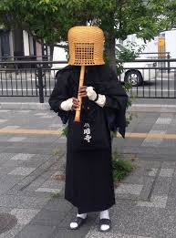
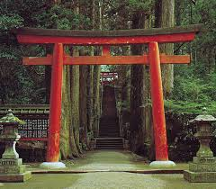
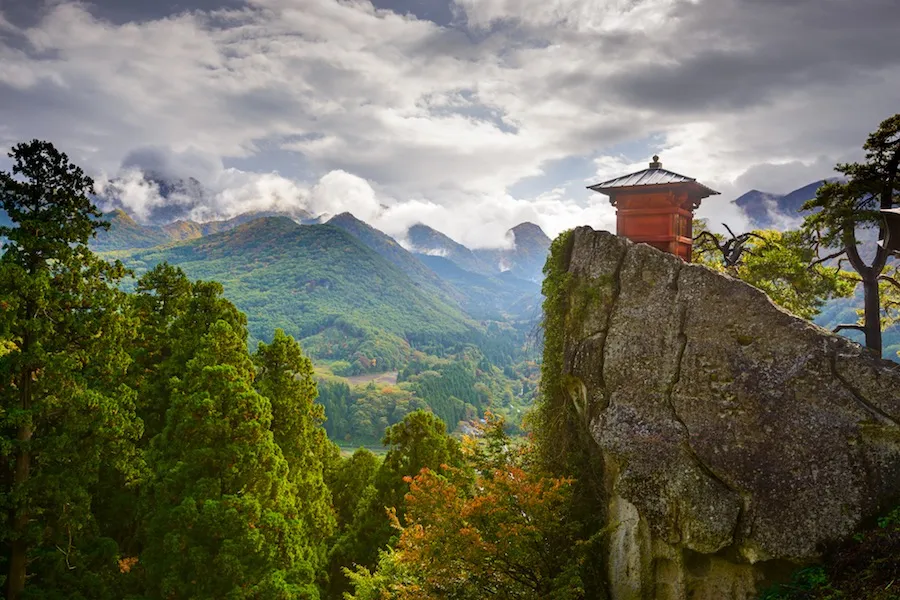
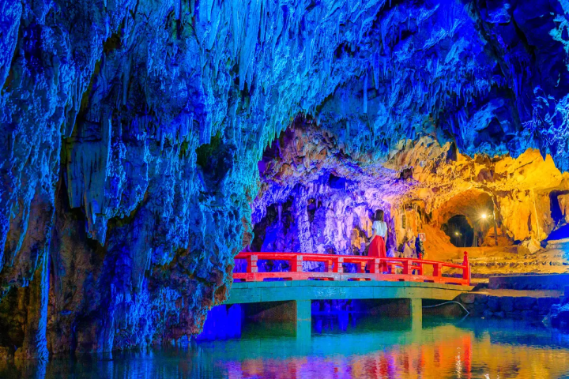
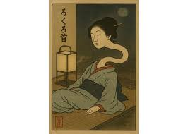
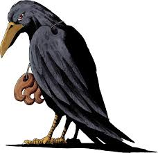
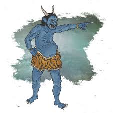

# 沈黙の山 : Silent Mountain

### Concept statement

Play as a wandering Komusō monk who weaponizes his shakuhachi flute to cleanse monsters on the mountain. Blast your way through atmospheric landscapes where the sound of the shakuhachi is the only power that matters.

---

### Genre(s)

Action platformer with elements of adventure. This is definitely a popular combination, but it is kept fresh by the cultural and thematic design elements.

### Target audience

Fans of games like Hollow Knight or Ori and the Blind Forest, those interested in Japanese culture, music, or meditative experiences. Stylized fantasy action with no blood or explicit violence, enemies disappear rather than die, so the game is appropriate for most ages.

### Unique Selling Points

The thematic elements and the incorporation of Japanese culture set this game apart from others in the same genre. Long and short blasts with an ammo system (breath meter) adds a dynamic element of challenge to the game to captivate players. This game will also feature lo-fi Japanese-style music to create an enjoyable ambient atmosphere, which will help players feel immersed in the game.

### Player Experience and Game POV

The player is a nameless Komusō monk wandering a mountain in feudal Japan that has fallen into silence. Armed with only a shakuhachi flute whose breath-powered blasts and sustained tones cleanse enemies back into harmony. Emotionally, the game brings the player through focused platform traversal and high-tension fights against monsters. Ultimately, players must push forward to reach the top of the mountain, driving excitement and difficulty as the game progresses.

### Core Loops
The core game loop is navigating platforms and defeating the enemies. The monk can utilize a short-range and long-range breath attack, which will have different properties and affect enemies differently. As the player passes through the levels to reach the top of the mountain, the enemies become stronger and the breath system needs to be managed more carefully to defeat the enemies.

---

### Visual and Audio Style

The visual style is retro-platformer inspired with pixelated art and Japanese-inspired thematic design elements. This is reflected in the Torii gates and temples in the background scenery and the Komusō monk character wielding a shakuhachi flute as a weapon. The enemies are also inspired by Japanese lore/mythology such as ghosts, crows (yatagarasu), and demons (oni). The audio will be lo-fi Japanese-inspired ambient music sourced from Youtube. 

    

Music Inspiration
- https://www.youtube.com/watch?v=gND5pFB9nmU&list=RDi4_KiNGCEe8&index=2
- https://www.youtube.com/watch?v=lCxXo3LFDa4&list=RDlCxXo3LFDa4&start_radio=1
- https://www.youtube.com/watch?v=i4_KiNGCEe8&list=RDi4_KiNGCEe8&start_radio=1

---

### Mechanics

The monk can freely run and jump around the map. In addition, using the shakuhachi, the monk can perform two kinds of attacks, a close-distance and long-range attack. 

The monk will have a cooldown on the shakuhachi so that attacks cannot be repeatedly launched. Each attack will use a certain amount of breath, which regenerates slowly over time, so the player has to manage their ammo (breath) while navigating the platforms and defeating the monsters.

Enemies:

---
- Ghost: does medium-range magic attacks and has a slow movement speed and low health (Introduced in Level 1)
    
---
- Yatagarasu (crow): High movement speed and does melee attacks with its claws. Also has low/medium health (Introduced in Level 2). 
---
- Oni (demon): Slow movement speed, has high health, and does a large amount of damage through physical attacks with its club (Introduced in Level 3). 

    
---
