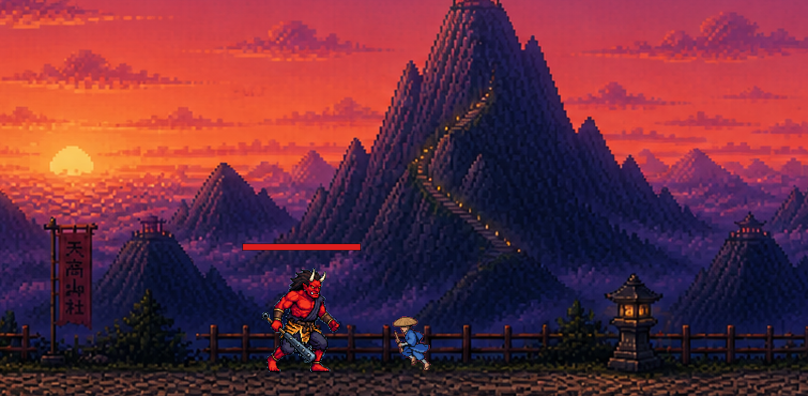
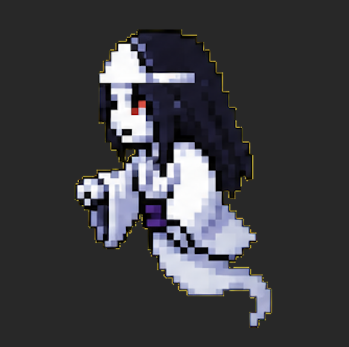
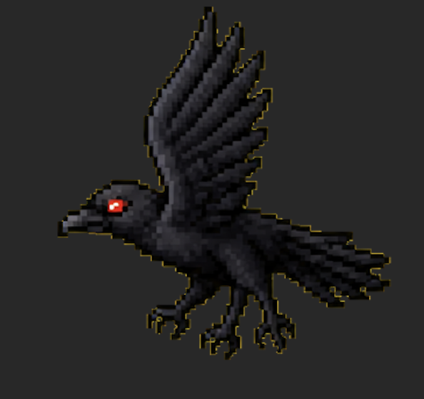
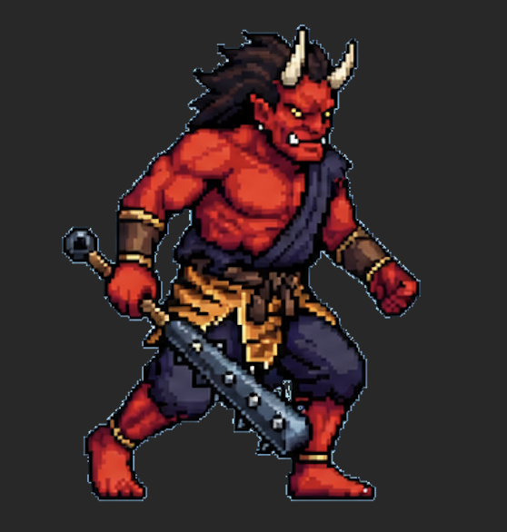

# 沈黙の山 : Silent Mountain

Jordan Shapiro

### Concept statement

| The Premise | |
| :--- | :--- |
| Play as a wandering Komusō monk who weaponizes his shakuhachi flute to cleanse monsters on the mountain. Blast your way through atmospheric landscapes where the sound of the shakuhachi is the only power that matters. The goal is to reach the top of the mountain and cleanse all the enemies along the way. You cannot advance until the mountain is once again peaceful. |  |

---

### Genre(s)

Action platformer with elements of adventure. This is definitely a popular combination, but it is kept fresh by the cultural and thematic design elements.

### Target audience

Fans of games like Hollow Knight or Ori and the Blind Forest, those interested in Japanese culture, music, or meditative experiences. Stylized fantasy action with no blood or explicit violence, enemies disappear rather than die, so the game is appropriate for most ages.

### Unique Selling Points

The thematic elements and the incorporation of Japanese culture set this game apart from others in the same genre. Long and short blasts with an ammo system (breath meter) adds a dynamic element of challenge to the game to captivate players. This game will also feature lo-fi Japanese-style music to create an enjoyable ambient atmosphere, which will help players feel immersed in the game.

### Player Experience and Game POV

The player is a nameless Komusō monk wandering a mountain in feudal Japan that has fallen into silence. Armed with only a shakuhachi flute whose breath-powered blasts and sustained tones cleanse enemies back into harmony. Emotionally, the game brings the player through focused platform traversal and high-tension fights against monsters. Ultimately, players must push forward to reach the top of the mountain, driving excitement and difficulty as the game progresses.

### Core Loops
The core game loop is navigating platforms and defeating the enemies. The monk can utilize a short-range and long-range breath attack, which will have different properties and affect enemies differently. As the player passes through the levels to reach the top of the mountain, the enemies become stronger and the breath system needs to be managed more carefully to defeat the enemies.

---

### Visual and Audio Style

The visual style is retro-platformer inspired with pixelated art and Japanese-inspired thematic design elements. This is reflected in the Torii gates and temples in the background scenery and the Komusō monk character wielding a shakuhachi flute as a weapon. The enemies are also inspired by Japanese lore/mythology such as ghosts, crows (yatagarasu), and demons (oni). The audio will be lo-fi Japanese-inspired ambient music sourced from Youtube. 

    

Music Inspiration
- https://www.youtube.com/watch?v=gND5pFB9nmU&list=RDi4_KiNGCEe8&index=2
- https://www.youtube.com/watch?v=lCxXo3LFDa4&list=RDlCxXo3LFDa4&start_radio=1
- https://www.youtube.com/watch?v=i4_KiNGCEe8&list=RDi4_KiNGCEe8&start_radio=1

---

### Mechanics

The monk can freely run and jump around the map. In addition, using the shakuhachi, the monk can perform two kinds of attacks, a close-distance and long-range attack. 

| Attacks | Description |
| :--- | :--- |
| Whirlwind | Close-up attack that consumes 25% of the breath meter. One-shots weak enemies and is strong against the Oni |
| Flute Blast | Long-range attack that consumes 40% of breath meter. One-shots weak enemies but is very weak against the Oni. Has a small hitbox, making it more challenging to land, so that ranged attacks cannot be abused |

The monk will have a cooldown on the shakuhachi so that attacks cannot be repeatedly launched. Each attack will use a certain amount of breath, which regenerates at a rate of 12.5% per second, so the player has to manage their ammo (breath) while navigating the platforms and defeating the monsters.

| Enemies | Image | 
| :--- | :---
| Ghost: does medium-range magic attacks and has a slow movement speed and low health (Introduced in Level 1)|   |
| Yatagarasu (crow): High movement speed and does melee attacks with its claws. Also has low/medium health (Introduced in Level 2). |  |
| Oni (demon): Slow movement speed, has high health, and does a large amount of damage through physical attacks with its club (Introduced in Level 3). |  |

### Technical Details

Unique technical details implemented in this game: 
- Enemies: The Enemy class is implemented as a base for all the enemies to function based off. The three specific enemy types extend this enemy class based on their needs, sharing certain base methods and attributes such as `width`, `height`, `x`, `y`, `get_rect()` and `get_hitbox_rect()`.
- Sine Movement: The Ghost and Yatagarasu (crow) implement movement along a sine function, and switch direction randomly. This was implemented with the assistance of claude.ai. 
- Tile Collisions: There are so many different tiles used in the level maps because there are three levels and many tiles to chose from. To make the `Utilities.draw_level()` function efficient as well as all instances of `handle_collisions()` that involved tiles, a two-way map was utilized (`Platformer.tiles` and `COLLISION_TILES`). This improved the portability of the code, so that more tiles could be added in the development process without significant change to code across all the files.
- Changing and Loading Levels: The loading of the level maps is handled at the start through calls to `Utilities.load_level()` and `Utilities.parse_level()`. Then, copies of the values returned for `Utilities.parse_level()` are made so that the list of enemies and game states can be reinitialized if the player loses or clears the game and wants to restart. To keep track of the the current level, the level is stored in the player as `self.level`, and when the player collides with the white `TILE_GOAL` after having defeated all enemies, this value is incremented causing the next level to load in and the variables pertaining to the current level to be updated.

### Art

- All visuals, with the exception of the heart texture ([found here](https://www.google.com/imgres?q=heart%20png%20texture%208bit&imgurl=https%3A%2F%2Fstatic.vecteezy.com%2Fsystem%2Fresources%2Fthumbnails%2F055%2F608%2F097%2Fsmall%2F8-bit-heart-icon-png.png&imgrefurl=https%3A%2F%2Fwww.vecteezy.com%2Ffree-png%2F8-bit-heart&docid=aULkN1zjLQ79mM&tbnid=k_DIkQ32ECdHsM&vet=12ahUKEwiInLTDlqCUAxUnmYkEHdxMO_oQnPAOegQIIBAB..i&w=350&h=350&hcb=2&ved=2ahUKEwiInLTDlqCUAxUnmYkEHdxMO_oQnPAOegQIIBAB)), were created using either OpenAI or Gemini's models. Frequently, and image was generated using Gemini's nano banana and then edited with ChatGPT. In order to remove the background from all spritesheets, I used the software GIMP to create and alpha layer and the selected with the "by color" tool to delete the background.
- Sample prompts for the sprite sheet generation:
    - I am creating an 8bit platformer game. Create a sprite sheet for a Japanese Oni that can swing a club and move left. Each step of the spritesheet should be evenly spaced apart, and the Oni should fit neatly into a square grid. The top row should be a walking animation which has a progression of the oni taking steps. The second row should be the oni progressively swinging a club.
    - In the third cell from the left on the bottom, edit the image so that within the cell, the whole demon's club is visible. Then modify this image to have no grid background. Instead make the background baby blue.
    - I am creating an 8-bit spritesheet of a komuso monk with a shakuhachi for the actions idle, run, jump, and flute blow. Create an animation sprite sheet with uniform spacing and sizing using a grid around each cell of the animation steps.

### References

- COSC481 Playful Thinking, Serious Coding at Colgate University 
- Projectile Drawing: The logic for drawing the projectiles with a gradient/multiple shades so that it fades from an outer color to a white core was done with the assistance of claude.ai.
- Liam helped me with AI prompting in lab on 4/29
- All sound effects in game were taken from pixabay.com 
- The bgm used can be found at https://www.youtube.com/watch?v=gND5pFB9nmU&list=RDi4_KiNGCEe8&index=2

